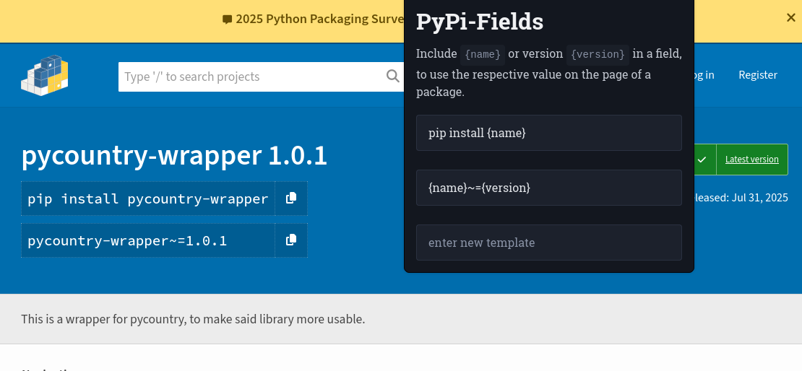

# PyPi-Fields Firefox Extension

<image src="popup/icon.svg" style="width: 3em; float: left; margin-right: 1em;"></image>

A lightweight Firefox extension that enhances your PyPi package browsing experience by making the fields that lets you copy the command to install configurable.

## Features

- **Multiple fields**: You can add as many fields as you want
- **Templating**: You can display any string you want, and use the variables `name` and `version`
- **Minimal Interface**: Clean, unobtrusive integration with PyPi package pages

## How It Works

When you visit a PyPi package page, PyPi-Fields automatically:

1. Extracts the package name and version from the page
2. Generates the previously configured string
3. Displays them in a convenient, easy-to-copy format
